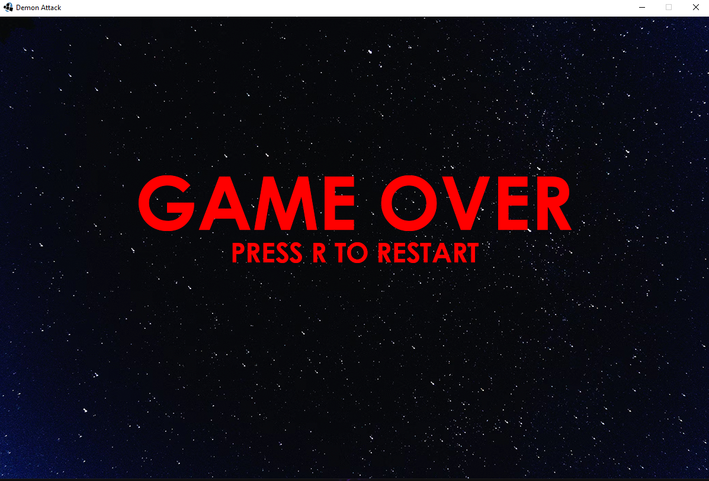

# Demon Attack

## Equipo de desarrollo

- Coiman, Fernando Agustin
- Del Rizzo, Valentín
- Giachetta, Franco 
- Yañez Romero, Diego 

## Capturas

(agregar)

## Reglas de Juego / Instrucciones
Nuestra version del arcade de 1982 para la consola Atari 2600.
El jugador debe usar su arma para destruir las legiones de demonios que atacan desde arriba.

Controles:  

**Enter** - para comenzar el juego  
**A** - Mover a Izquierda  
**D** - Mover a Derecha  
**Barra Espaciadora** - Disparar  

El juego finaliza cuando el jugador pierde 3 vidas

## Otros

- Curso K2104 (Jueves Mañana / UTN FRBA) 
- Versión de wollok
- Una vez terminado, no tenemos problemas en que el repositorio sea público
